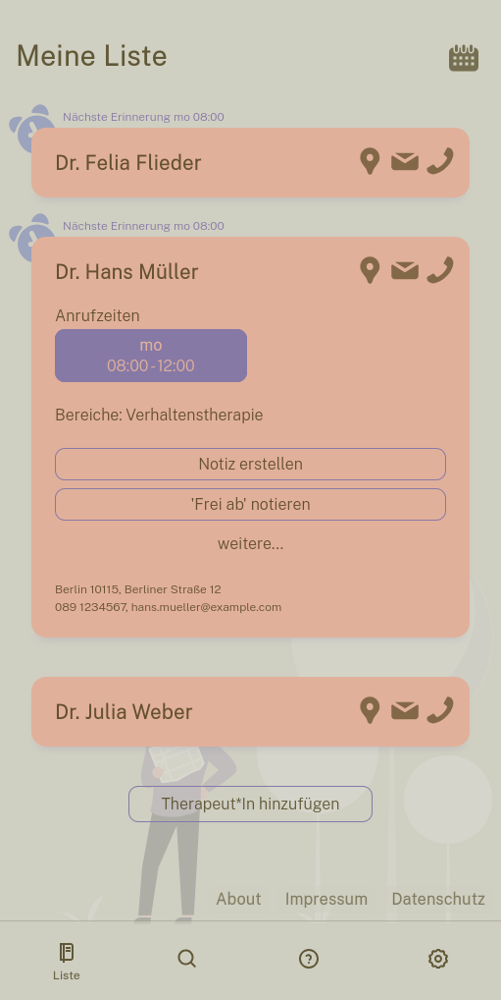
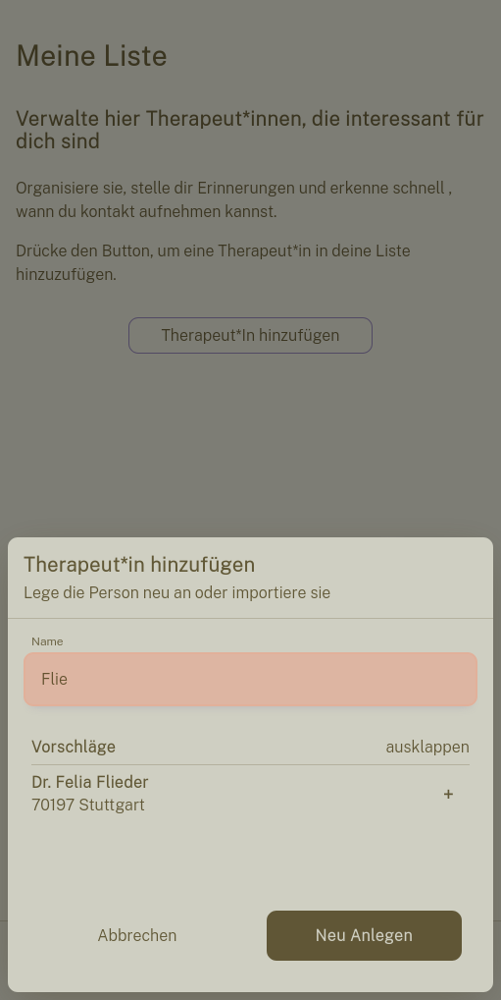
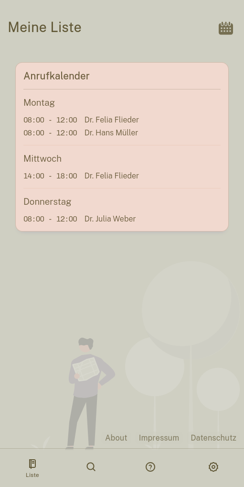

# Buddy

## Features

### 🛠 **Manage Your Therapists**

-  Add, edit, and delete therapists you find interesting.
-  Save detailed therapist profiles, including:
   -  Contact information
   -  Availability (times when they can be called)
   -  Specific areas of expertise
   -  Any additional notes or important details.

### ⏰ **Get Notified**

-  Receive reminders shortly before therapists are callable.

### 🤝 **Collaborative Therapist Database**

-  Your saved therapists are stored locally and in a shared database.
-  The shared database allows all users to contribute and benefit from a growing, consolidated repository of therapists.
-  Simplifies the process of finding a therapist by leveraging community-driven data.

## Tech Stack

### **Frontend**

-  **Angular**: For building a responsive, mobile-friendly PWA.
-  **PWA**: Supports offline functionality and push notifications.

### **Backend**

-  **Express.js**: Provides a robust REST API for managing therapist data and user actions.

### **Database**

-  **PostgreSQL**: Ensures reliable and efficient data storage for user and shared therapist records.

### **Monorepo Management**

-  **NX**: Streamlines development by managing both the Angular frontend and Express backend in a single monorepo.

## Questions?

Feel free to reach out by opening an issue or contributing directly. Together, we can make finding the right therapist easier for everyone! 💙
